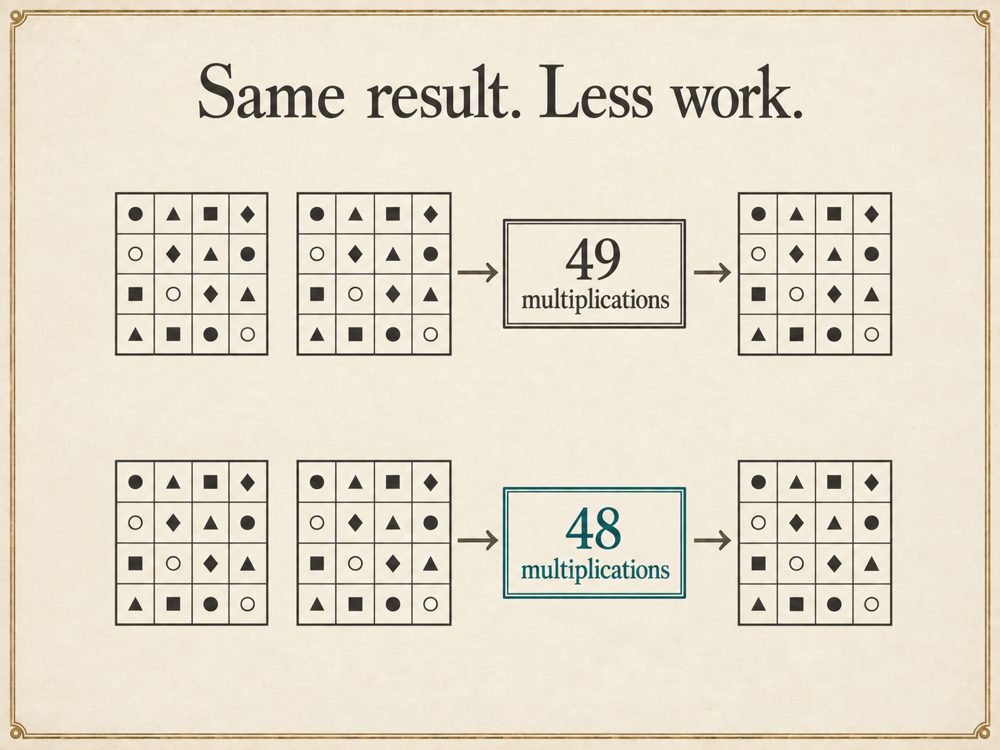
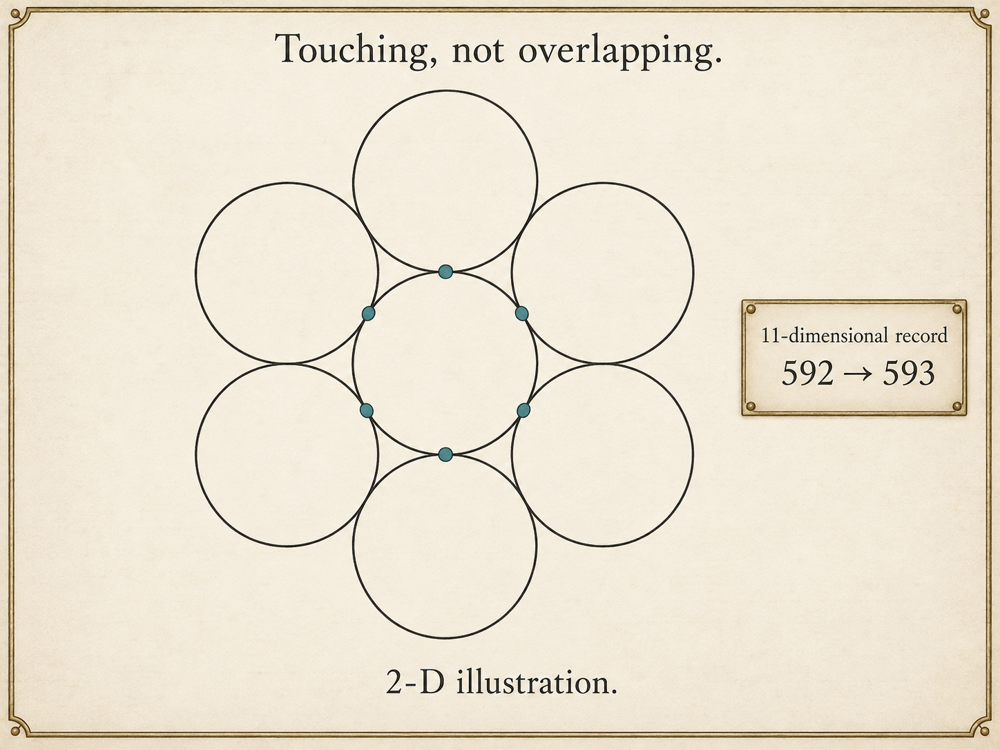
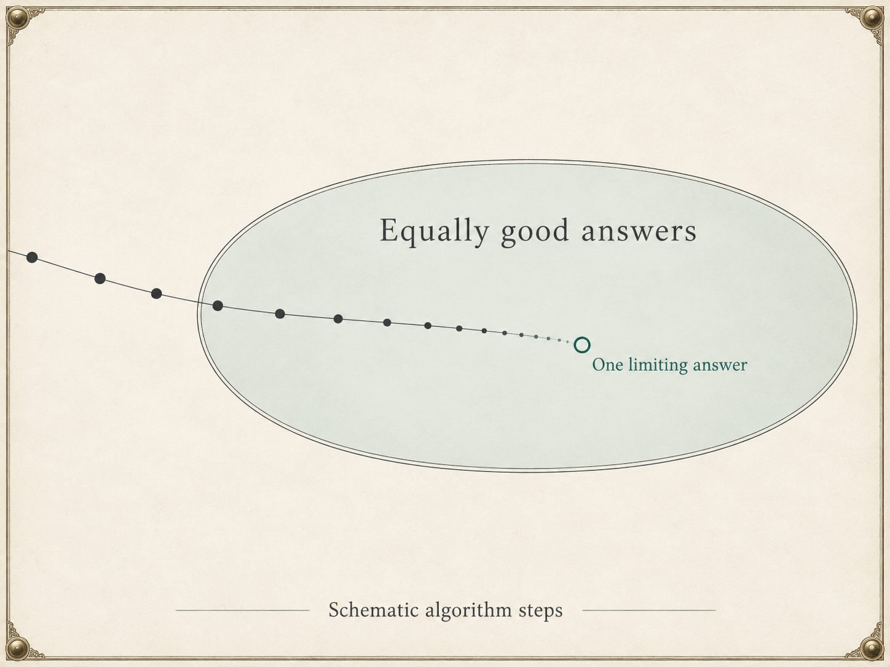
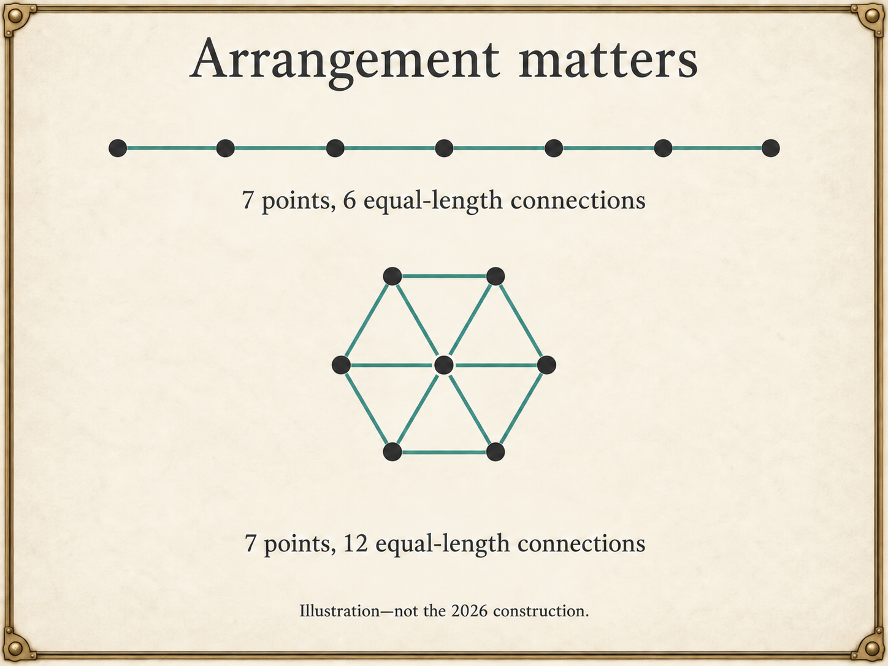
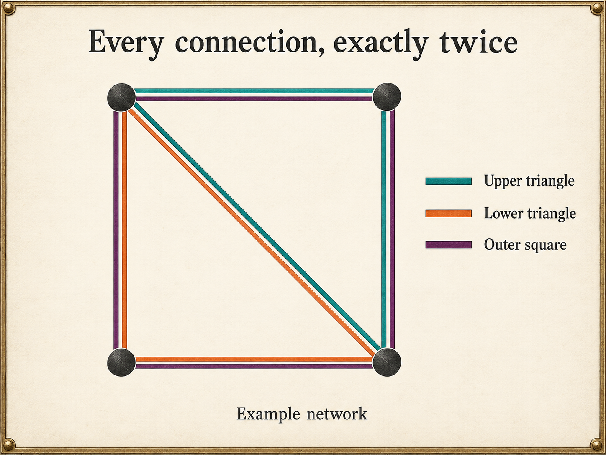
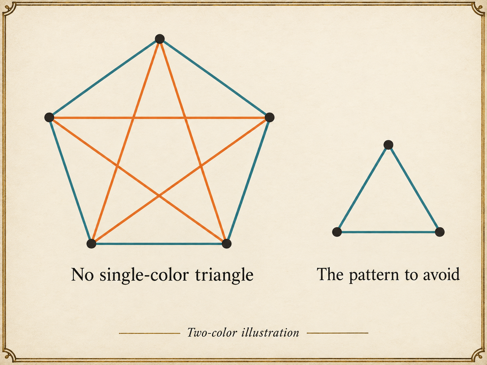
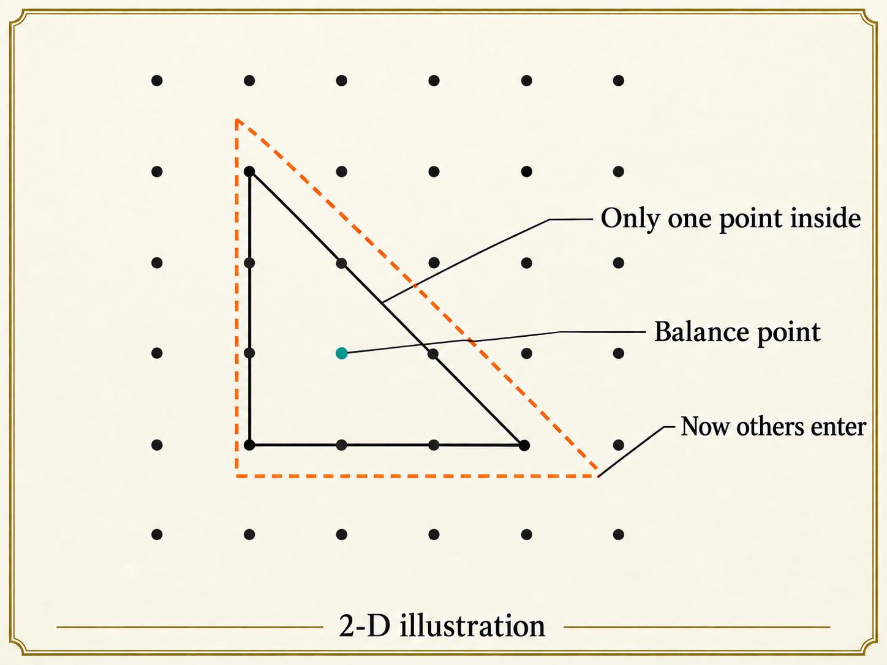
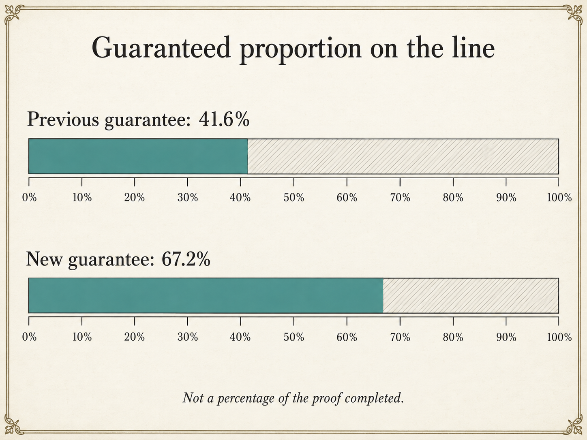
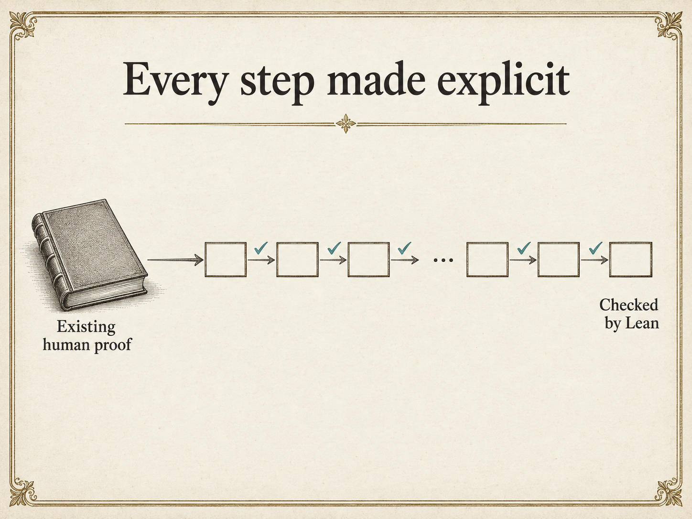
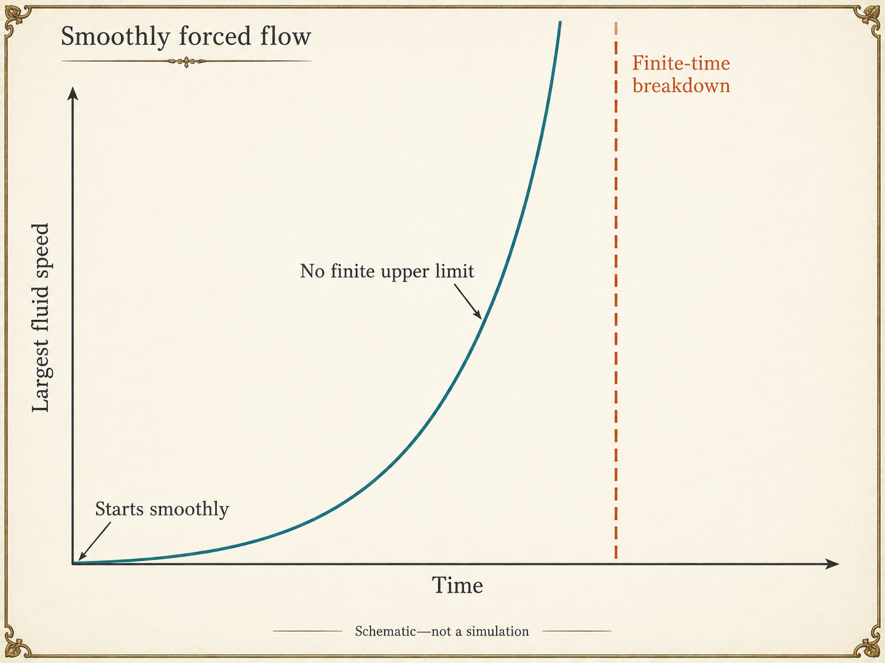

# Ten steampunk mathematical plates

Ten locally saved generated PNGs, each 1448 × 1086 (4:3).

[Production prompts](prompts.md) · [Astro research and ten interaction proposals](../research/astro-interactivity-2026-09-08.md)

Visually checked for labels, intended relationships, counts, and unwanted decoration. Raster geometry remains illustrative: use calculated SVG/HTML for exact interactive measurements, especially scaling and percentage widths.

## 1. The same calculation with less work

## 2. Finding room for one more

## 3. Settling on one answer

## 4. Arrangement matters

## 5. Every connection, exactly twice

## 6. Avoiding a single-color triangle

## 7. Space around one grid point

## 8. A stronger proportion guarantee

## 9. Every step made explicit

## 10. A smooth beginning, a singular ending

